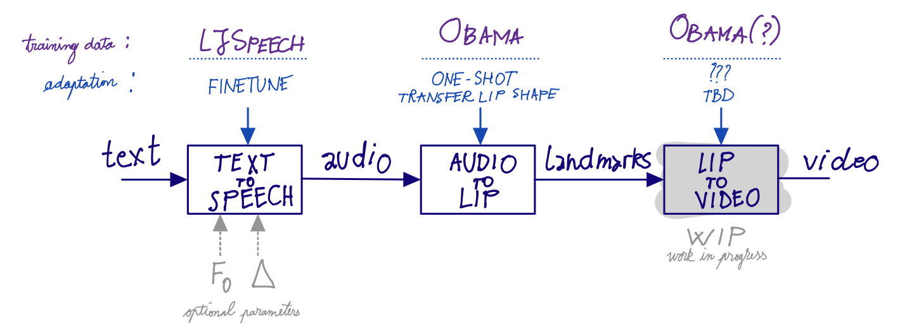
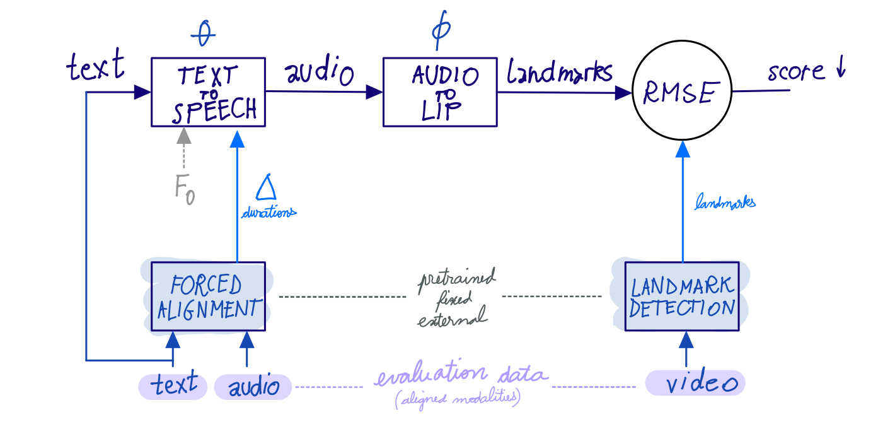

# Humans: Controllable avatar animation

Our task is to obtain a video of a talking face starting from a text and an identity.
We divide the pipeline into three main steps:
1. text to speech
2. speech to keypoints
3. keypoints to video

Specifying the steps separately allows for
ⅰ. controllability and
ⅱ. to evaluate the components independently.
In particular we show that:
- the speech-to-keypoints component is robust to various types of audio (real or synthesized, gender, race, language, accent)
- we leverage the controllability of the TTS system to evaluate the first two components as a whole

## Text to speech

We use the [FastPitch](https://fastpitch.github.io) (Łańcucki, 2021) method which has the ability to predict the audio in a parallel, non-autoregressive manner.
Its main idea lies in inferring high-level structure (F0 pitch and phone duration) from the audio, which allows to generate the corresponding audio directly without relying on the previously generated data.
Allowing to specify the duration is crucial not only for prediction, but it also allows us to evaluate the text-to-keypoint component as a whole.

## Audio to keypoints

Lips can appear at various location, scales and rotations in a video.
For this reason we normalize their coordinates.
We also project the data into 8D using PCA.
Hence, our method maps a stream of audio to a list of 8D points.
These are the easily inverted via PCA.

**Domain adaption.**
When working on an unseen person (zero-shot scenario),
the generated lips move fine, but their shape resembles the one of the trained subject.
We adapt to the new person using a single frame, by replacing the training subject's mean with the one of the target speaker.
This is inexpensive and works well in practice.

## Keypoints to video

## Experiments

**Evaluating text-to-keypoints.**

## References

- Łańcucki, Adrian. "FastPitch: Parallel text-to-speech with pitch prediction." ICASSP, 2021. [paper](https://arxiv.org/abs/2006.06873)
